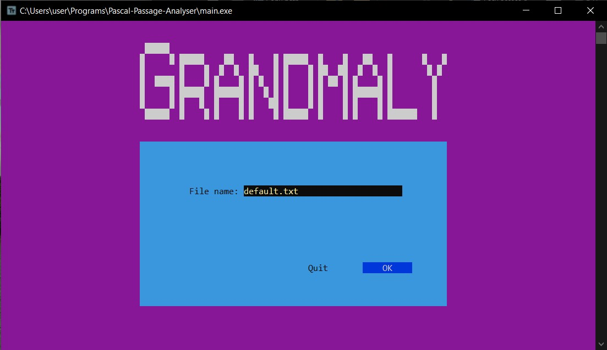
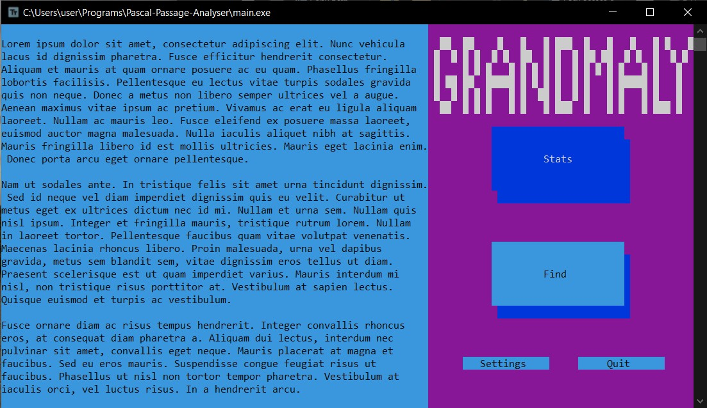
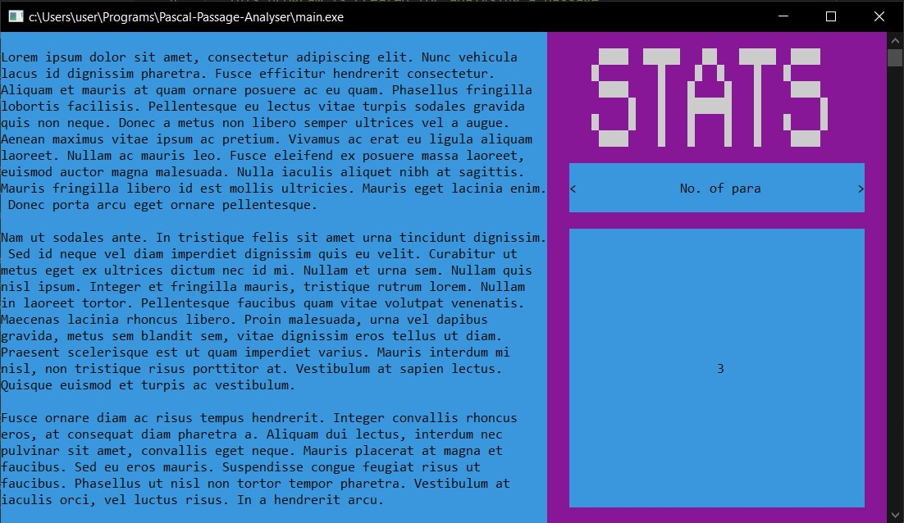
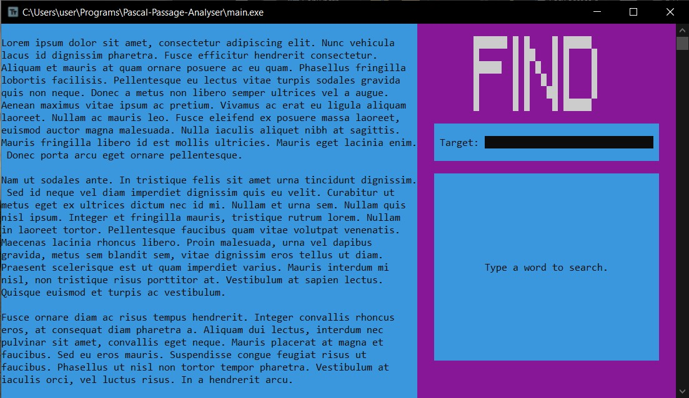
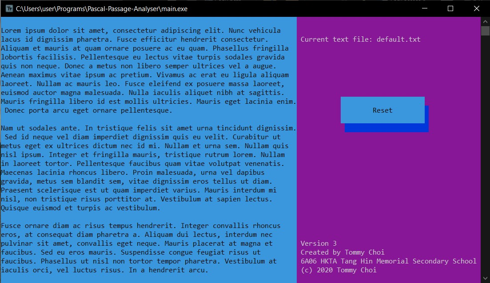

# Grandmaly - A feature-poor passage analyzer


This project is created for 2020 HKDSE Information and Communication Technology School-based assessment. _**Grandmaly**_ is a simple passage analyzer that aims to provide basic (but **inaccurate**) statistics for your primary-school level composition. So before submitting your childish, poor-organized, vocabulary-insufficient piece of writing to your trash English teacher, remember loading it into _Grandmaly_, she will help you take a look on it, and give you brief (sometime useless) feedback to the passage, like a grandma. ~~(Actually not related)~~

## Features

**Basic statistics** (may not be accurate):
- Number of words
- Number of characters
- Number of paragraphs
- Number of sentences
- Reading score
- Reading time ([Source](https://en.wikipedia.org/wiki/Flesch%E2%80%93Kincaid_readability_tests))
- Number of unique words
- ~~Grammar checking~~ <- never
- ~~Spell checking~~ <- never

**Find**: type a search target and the program will highlight the corresponding text in the passage

## Design

**Units**:
- [ui.pas : custom UI components](ui.pas)
- [passageAnalyser.pas : functions related to passage analyzing](passageAnalyser.pas)
- [longStringType.pas : custom string type storing array of char](longStringType.pas)
- [stringListType.pas : custom string list type](stringListType.pas)

**UI screenshots**:

I just used the colors available to design the UI, including blue, green, gray, cyan, yellow, red, magenta and black. No fancy colors.











## Document

[Report](ICT SBA report.pdf)

## Compile

  Compile the file ```main.pas``` using any pascal compiler, and run the ```main.exe```